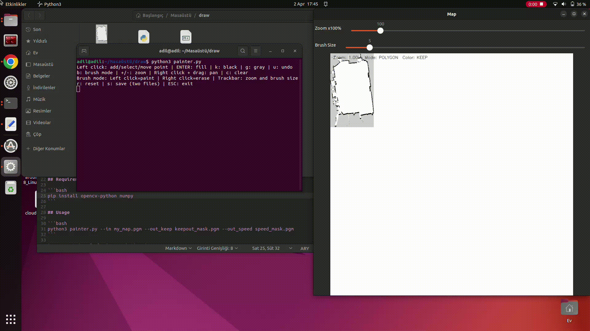
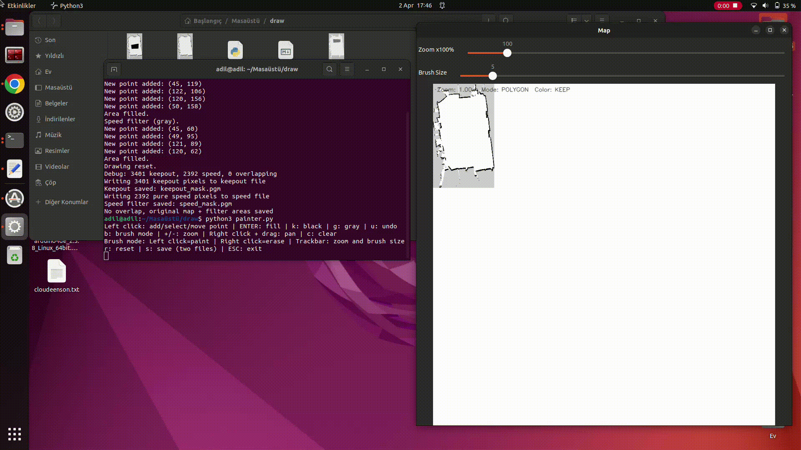

# ros2-map-zone-painter

Interactive tool for painting keepout and speed filter zones on ROS2 PGM map files.

## Overview

This tool lets you draw restricted areas directly on your robot's map using polygon or brush modes. It produces two separate mask files compatible with the ROS2 Navigation2 (Nav2) costmap system:

- **Keepout mask** — hard no-go zones (black pixels)
- **Speed filter mask** — zones where the robot slows down (gray pixels)

## Demo

**Polygon Mode**


**Brush Mode**


## Requirements

```bash
pip install opencv-python numpy
```

## Usage

```bash
python3 painter.py --in my_map.pgm --out_keep keepout_mask.pgm --out_speed speed_mask.pgm
```

| Argument | Default | Description |
|---|---|---|
| `--in` | `my_map.pgm` | Input map file |
| `--out_keep` | `keepout_mask.pgm` | Keepout zone output |
| `--out_speed` | `speed_mask.pgm` | Speed filter zone output |

## Controls

### General

| Key / Action | Description |
|---|---|
| `k` | Switch to **keepout** color (black) |
| `g` | Switch to **speed filter** color (gray) |
| `b` | Toggle between **polygon** and **brush** mode |
| `s` | Save and exit |
| `ESC` | Exit without saving |
| Scroll wheel | Zoom in / out |
| Right click + drag | Pan |

### Polygon Mode

| Key / Action | Description |
|---|---|
| Left click | Add a point |
| Left click on existing point + drag | Move a point |
| `ENTER` | Fill the polygon |
| `u` | Undo last point |
| `c` | Clear the current polygon area |
| `r` | Reset all polygon points |

### Brush Mode

| Key / Action | Description |
|---|---|
| Left click + drag | Paint |
| Right click + drag | Erase |
| Brush size trackbar | Adjust brush size (px) |
| `c` | Clear entire mask for current color |

## Output Format

| File | Content |
|---|---|
| `keepout_mask.pgm` | Original map + keepout areas painted black (`0`) |
| `speed_mask.pgm` | Original map + speed zones painted gray (`128`), all black pixels converted to white |

The speed mask has all black pixels (walls + keepout) converted to white so Nav2 only sees the gray speed filter zones — no unintended obstacles.

## Nav2 Integration

Use the output files as costmap filter masks in your Nav2 configuration:

```yaml
# keepout_filter.yaml
keepout_filter:
  ros__parameters:
    enabled: True
    filter_info_topic: "/costmap_filter_info"
    mask_topic: "/keepout_filter_mask"

# speed_filter.yaml
speed_filter:
  ros__parameters:
    enabled: True
    filter_info_topic: "/costmap_filter_info"
    mask_topic: "/speed_filter_mask"
```

<div align="center">

**MIT License © 2026 Adil NAS**

[](https://github.com/Adilnasceng)
[](https://github.com/sponsors/Adilnasceng)

</div>
